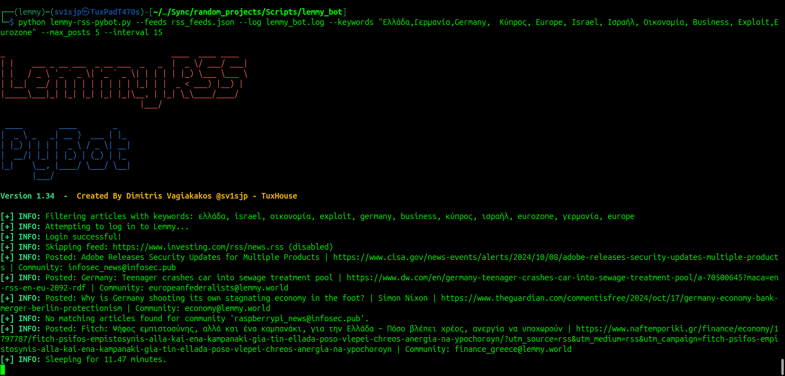

# Lemmy RSS PyBot 🤖


*Bringing the latest news to your Lemmy communities!*

[](https://www.gnu.org/licenses/agpl-3.0.html)
[](https://www.python.org/downloads/release/python-390/)

## 🚀 Introduction

Lemmy RSS PyBot is a powerful Python bot that reads RSS feeds and posts new articles to your favorite Lemmy communities. Stay updated with the latest news, blogs, and articles time-efficiently! 🤓

## ✨ Features

- 📥 Reads RSS feeds from a JSON file with associated communities.
- 📝 Posts new articles to specified Lemmy communities.
- 🔍 Filters articles based on keywords specified via arguments or a file.
- ⏰ Checks for new articles every specified interval.
- ⚙️ Uses configuration files for settings and credentials.
- 📑 Keeps a log of posted articles with rotating logs and auto-clearing mechanism.
- 🛠️ Supports command-line arguments for customization.
- 💡 Includes comprehensive error handling and logging.
  

## 📦 Requirements

- Python 3.9 or higher,
- Lemmy account credentials in the .env file,
- Access to Lemmy instance API,
- A json file with the desired RSS links and communites with a true label to enable them.

## 🛠️ Installation

### Locally

```bash
git clone https://github.com/sv1sjp/lemmy_rss_pybot.git
cd lemmy_rss_pybot
```

### Install Requirements

```bash
pip install -r requirements.txt
```

## 🔧 Configuration

### Environment Variables

Create a `.env` file in the root directory and add your Lemmy credentials:

```dotenv
LEMMY_USERNAME=your_lemmy_username
LEMMY_PASSWORD=your_lemmy_password
LEMMY_INSTANCE_URL=https://your.lemmy.instance.url
```

### RSS Feeds

Create a `rss_feeds.json` file to specify the RSS feeds and the Lemmy communities they should post to:

```json
[
    {
        "feed_url": "https://newssite1.com/rss",
        "community": "news@lemmy.example2",
        "enabled": true
    },
    {
        "feed_url": "https://anotherexample.com/feed",
        "community": "technology@lemmy.exampple1",
        "enabled": false
    }
]
```

### Keywords (Optional)

You can filter articles by keywords using a file or command-line arguments.

- Create a `keywords.txt` file with one keyword per line.
- Or specify keywords via the `--keywords` argument.

## 🏃‍♂️ Usage

### Running Locally

```bash
python lemmy_pybot.py --feeds rss_feeds.json --log lemmy_bot.log --interval 15
```

#### Examples

1. **Basic Usage:**

    ```bash
    python lemmy_pybot.py
    ```

2. **Using Specific Time Interval:**

    ```bash
    python lemmy_pybot.py --feeds rss_feeds.json --log lemmy_bot.log --time 20
    ```

3. **Post Simultaneously to Communities (2 posts each):**

    ```bash
    python lemmy_pybot.py --feeds rss_feeds.json --log lemmy_bot.log --simultaneously 2 --interval 10
    ```

4. **Verbose Mode:**

    ```bash
    python lemmy_pybot.py --feeds rss_feeds.json --log lemmy_bot.log --verbose
    ```

5. **Keyword Filtering:**

    ```bash
    python lemmy_pybot.py --feeds rss_feeds.json --keywords "technology, Europe, science" --max_posts 5
    ```

6. **Keyword Filtering from File:**

    ```bash
    python lemmy_pybot.py --feeds rss_feeds.json --keywords-file keywords.txt --max_posts 5
    ```

7. **Keyword Filtering with Custom Keywords:**

    ```bash
    python lemmy_pybot.py --feeds rss_feeds.json --log lemmy_bot.log --keywords "Python, AI, Machine Learning" --max_posts 5 --interval 15
    ```
8. ** Show detailed instructions: **
    
    ```bash
    python lemmy_pybot.py --help
    ```
### Running with Docker 🐳

#### Build the Docker Image

```bash
docker build -t lemmy-rss-pybot .
```

#### Run with Docker Compose 🐳

```bash
docker-compose up -d
```

## 🎯 Contributing

Contributions are welcome! Please open an issue or submit a pull request.

## 📄 License

This project is licensed under the GNU Affero General Public License (AGPL) - see the [LICENSE](https://www.gnu.org/licenses/agpl-3.0.html) file for details.

---

## 🤝 Contributing
Contributions are welcome! Feel free to fork the repository and submit a pull request. If you encounter any issues, please open an issue on GitHub. 

---

## ⚠️ Troubleshooting
- **Environment Variables Not Loaded**: Ensure you have a valid `.env` file in the root directory.
- **Missing Dependencies**: Run `pip install -r requirements.txt` to make sure all required packages are installed.
- **Syntax Issues in the JSON file**: Check the example RSS feeds JSON file.
- If you encounter any issues, please check the logs for more details.
```bash
tail -f lemmy_bot.log
```


🚀 **Lemmy RSS PyBot** – Created by Dimitris Vagiakakos [@sv1sjp](https://sv1sjp.github.io/whoami) - TuxHouse
